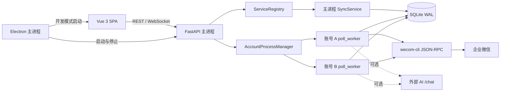

# 架构设计

## 系统目标

本项目在 `wecom-cli` 之上提供本地企微私聊管理能力。设计重点是：

- 通过 SQLite 缓存减少 UI 对企微接口的直接依赖。
- 通过“每账号一个 worker 子进程”隔离账号凭据、轮询故障和暂停状态。
- 将同步、业务策略、API 展示和桌面进程管理分层，避免业务逻辑进入 RPC 适配层。
- 在上游只提供轮询能力的前提下，提供接近实时且可恢复的本地体验。

## 运行时拓扑

Electron 只是可选桌面壳。浏览器模式下可以直接启动 FastAPI，并由后端提供
`frontend/dist` 中的静态资源。

## 进程模型

### FastAPI 主进程

`backend/app/main.py` 负责应用生命周期：

1. 创建 `data/`、`data/logs/` 和 `media/`。
2. 打开 SQLite，清理上次异常退出留下的 worker。
3. 加载全部账号状态，并为已启用账号启动 worker。
4. 提供 REST、媒体文件、WebSocket 日志和 SPA fallback。
5. 退出时停止全部 worker 并关闭数据库连接。

主进程中的 `SyncService` 主要服务读 API 和手动发送。轮询数据由 worker 写入 SQLite；
读请求通过 `refresh_from_db_if_stale()` 比较 `last_sync`，仅在数据变化时刷新内存快照。

### 每账号 worker

`backend/scripts/poll_worker.py` 由 `AccountProcessManager` 启动。每个进程持有自己的
SQLite 连接和账号 `config_dir`，循环执行：

1. `SyncService.sync_once()` 拉取联系人和近期私聊。
2. 执行媒体自动拉黑策略。
3. AI 自动回复开启时，处理最多 3 个待回复会话。
4. 等待当前 `poll_sec` 后进入下一轮。

worker 的 stdout/stderr 写入 `data/logs/{account_id}.log`。日志超过 10 MiB 时，由父进程
在下次启动 worker 前轮转并保留一个 `.log.1` 备份。

## 同步数据流

`SyncService.sync_once()` 的主要步骤如下：

1. 从 `wecom-cli` 获取联系人列表。
2. 对每个联系人拉取 `chat_type=1` 的近期私聊；单个联系人失败时保留上次快照。
3. 下载消息媒体并按需要转码；若 `media_id` 变化，按发送者、时间和类型复用本地文件。
4. 合并服务端消息与尚未回显的本地 `_pending` 消息。
5. 通知独立的 conversation update handlers。
6. 更新内存状态并将该账号快照写入 SQLite。

当前 handler 是 `MediaBlacklistService`。第一次同步只建立基线；之后发现客户新增入站
图片或视频时，按账号将该客户写入黑名单。策略异常只记录日志，不中断主同步。

## AI 自动回复

`AutoReplyService` 只处理最新一条为入站文本、且尚未回复的会话：

- 必须能确定 `self_userid`，否则无法可靠区分收发方向并会跳过自动回复。
- 黑名单在生成前和发送前各检查一次。
- 每条入站消息通过 `reply_cursors` 去重。
- cursor 在发送前持久化，优先避免进程崩溃后重复打扰客户；代价是发送失败时该条回复
  不会自动重试，下一条入站消息才会恢复处理。
- AI 连续失败 3 次后熔断 120 秒。

## 模块边界

- `backend/app/api/`：HTTP 与 WebSocket 展示层，只做校验、依赖解析和响应映射。
- `backend/app/schemas/`：Pydantic API 契约。
- `backend/app/services/`：同步、发送、自动回复、媒体拉黑等业务编排。
- `backend/app/subprocess/`：账号注册和 worker 生命周期。
- `backend/app/core/`：薄的 `wecom-cli` RPC、媒体处理、运行时设置和进程控制原语。
- `backend/app/db/`：SQLite schema 与 repositories。
- `frontend/src/`：Vue 页面、API 客户端、类型和日志状态。
- `electron/`：桌面窗口以及 Python/Vite 子进程编排。

新增业务规则应优先放在 `services/`，不要放入 `core/rpc.py` 或 FastAPI 路由。新增持久化
能力应通过 repository 暴露，避免在 service 中散落 SQL。

## 持久化模型

所有账号共享 `data/wecom.db`，通过 `account_id` 隔离数据。SQLite 使用 WAL 模式和
5 秒 `busy_timeout` 支持主进程与多个 worker 并发访问。

主要数据表：

- `accounts`：账号、凭据目录、己方用户 ID 和启用状态。
- `meta`：账号同步时间和推断出的己方用户 ID。
- `users`、`conversations`、`messages`：每账号同步快照。
- `app_settings`：轮询与 AI 等可由 UI 修改的全局设置。
- `blacklist`：每账号黑名单。
- `reply_cursors`：AI 自动回复去重游标。

同步快照保存采用账号级替换语义。修改 repository 或同步流程时，必须同时考虑多个
worker 写入、主进程读缓存以及 `_pending` 消息合并。

## 关键不变量

- 所有账号相关读写必须显式保留 `account_id` 边界。
- 所有 `wecom-cli` 调用必须透传账号的 `config_dir`。
- 同步单个联系人失败不能清空该联系人的上次成功快照。
- 第一次同步不得因历史图片或视频自动拉黑客户。
- 自动回复不得在 `self_userid` 未知时猜测消息方向。
- API、worker 和前端共享的字段发生变化时，Pydantic 模型、前端类型和 API 文档必须
  一起更新。
